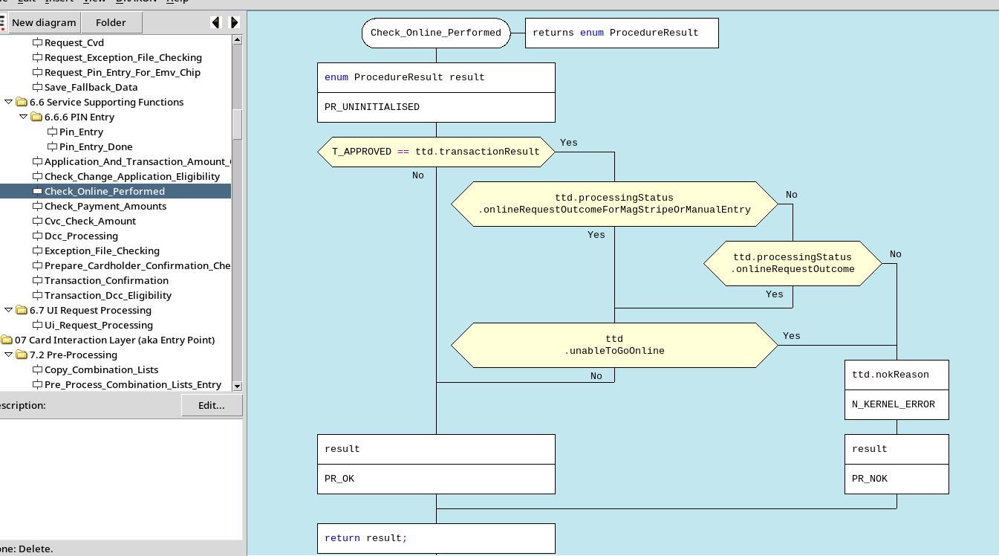
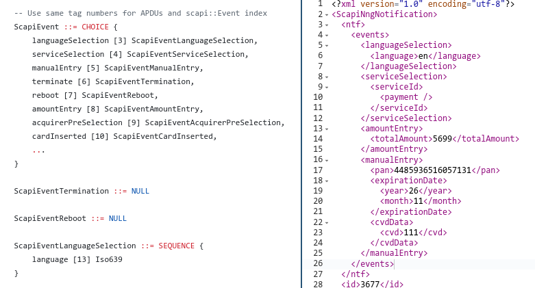
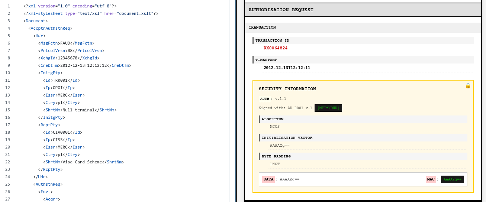

# Nexoid Financial Application Core Toolkit

**This project is WIP, many components implement only minimum to be useful**

Visit [live demo](https://nexoweb.online/nexo)!

This repository provides links and centralizes access to all tools developed as
part of nexoid project.

## Project structure

#### nexoid-ed/

Implementation of [NEXO FAST](https://www.nexo-standards.org/) business logic
as a standalone C library.

Source is readable as a visual document:

Which defines standard interfaces to low-level and proprietary mechanisms:

#### nexoid-protocol-collection/

Formalized definitions (in [ASN.1](https://en.wikipedia.org/wiki/ASN.1)) of
communication protocol between FAST, SCAP, HAP, TMAP and other components.

It allows automated code generation for many target languages while supporting
a large selection of transport encodings ranging from packed binary to XML and JSON.

Declarative definitions specify _meaning_ which can be encoded for example as XML:

#### nexoid-fat-cpp/

Main application, written in C++ – a safe, network-oriented wrapper around
`nexoid-ed`. Communicates using ASN.1 messages via [NNG](https://nng.nanomsg.org/)
protocol, but it is easily expandable to any transport mechanism (there is
`libsocket`-based transport as an example of expandability).

#### nexoid-nexui-flask/

Demo webapp (currently [live](https://nexoweb.online/nexo)), used to demonstrate
versatility of deployments. It implements a demo SCAP in a browser which you
can use to send dummy transactions to FAST in the back-end.

#### nexoid-scapp-c/

*WIP* Implementation of SCAP suitable for real-world terminals, works on very
constrained devices with or without display. Tested on real hardware.

### Experiments/

Folder that contains experimental and very rough code

#### nexoid-ed-ada/

Reimplementation in verifiably safe [Ada](https://www.adacore.com/languages/ada)
programming language – this is my future direction. This language allows very
advanced features, like proving accessibility of global variables, preconditions,
postconditions and invariants of procedures.

#### nexoid-tc-pheneste/

An attempt to codify couple of official test-cases using Temporal Logic formalism.

#### frobd/

Very rough scetch of a proxy for Polish EFT protocol [FROB](https://frob.pl/protokol-ecr-eft/#ECREFT),
can be embedded into any application and converts national protocol into SCAP or
NEXO retailer.

### Tools/

#### nexoid-card-simulator/

*WIP* Contactless card simulator for NXP NFC USB dongle by [mikroe](https://www.mikroe.com/nfc-2-click).
Currently supports only 2 cards, but is expandable via a domain specific language.

#### nexoid-visual-caaa/

Quite old tool to visualize CAAA ISO 20022 messages in a browser:

Doesn't work with modern browsers because client-side XSLT is deprecated and
removed from all of them. You have to use for example `xsltproc` program to
perform transformation instead.

### Dependencies

Links to 3rd party tools used for development.

#### drakon-editor

Drakon diagram editor and compiler. Main GUI application used for development,
allows compilation of visual block diagram into executable code. It isn't
actively developed anymore, so there is a plan to either continue using my fork
or migrate to some other tool.

#### asn1tools

Python library for ASN.1, used for online demo webapp.

### Distribution

A place for distribution specific scripts, `arch` subfolder contains build
instructions for Arch Linux and derivatives.

